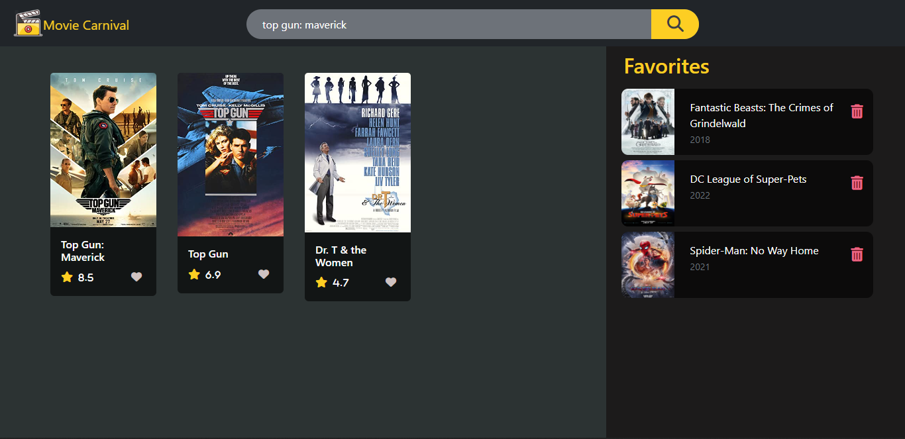
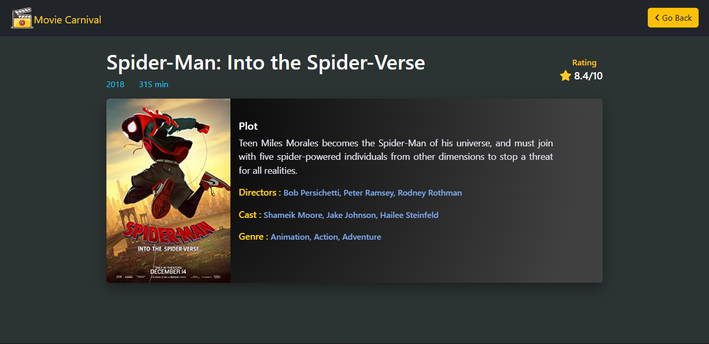

# IMDB-clone app

A mini IMDB clone app in which we can search movies based on OMDB API, with search suggestions. 
Clicking on a particular movie card opens a new movie page for more info.
On clicking on the favourite button, we can add a movie to the favourite list which is using local storage to store movies.  

### Hosted link: [IMDB-clone](https://rahul4019.github.io/IMDB-clone/)

## Tools used:
* HTML
* CSS
* Bootstrap
* JavaScript
* OMDB API

### Functionality
* Search movies with suggestions
* Click on Movie card for more info
* Add a movie to the favourites list
* Delete movie from the favourites list

### Data
* suggestionList - an array which contains a list of movies based on searched keywords.
* favMovieArray - an array that gets movies from the local storage. 
* movieName - local Storage item which contains the name of clicked movie card.

### Functions (in code)
* fetchMovies
* addToSuggestionContainerDOM
* handleFavBtn
* addToFavDOM
* deleteMovie
* notify
